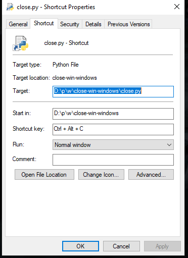

# close-win-windows
Script to close specified windows.

| NOTE: This script only works on `windows`. |
| --- | 

| WARNING: when you close the process, it will close the process in all desktops in anywhere. |
| --- | 

## How to Use
1. Pull the repository in your system
    ```bash
    git pull https://github.com/parsariyahi/close-win-windows.git
    ```
2. Write your processes you want to close each time into `proc_names.txt`, the format is:
    ```text
    PROC_NAME.exe
    PROC_NAME2.exe
    ...
    ```
3. Then run the script by clicking or run it in your console:
    ```bash
    python close.py
    ```
    > the script uses `taskkill /im` to kill the process, and will not use `/f` to force.
4. If you want to use this on your daily bases you can create keyboard shortcut for it
   1. Right click on `close.py` and choose `create shortcut`
        <p align="left">
            
        </p>
   1. Right click on shortcut you created, choose `properties` and write your shortcut in `shortcut key` field
        <p align="left">
            
        </p>
